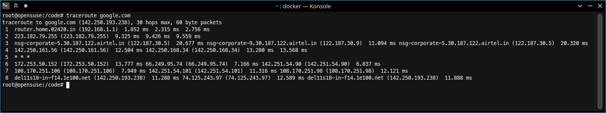
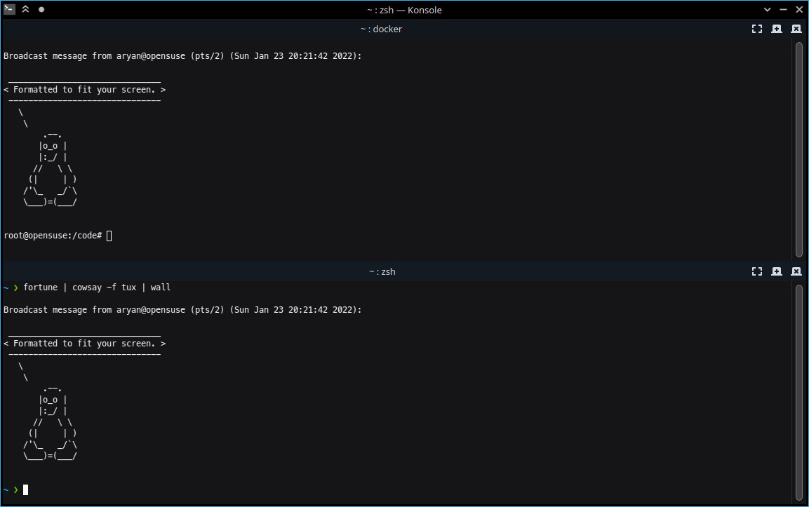

# Lab 1: Network Commands

#### Aryan Tyagi
##### 2019A7PS0136G

## 1. `tcpdump`

`tcpdump` - dump traffic on a network

`tcpdump` is a data-network packet analyzer. It reads packets from a network interface card and shows their source/destination addresses, size, protocol etc. It can also be used to intercept unencrypted data sent over HTTP

## 2. `ifconfig`

`ifconfig` - configure a network interface

`ifconfig` displays the status of the active network interfaces. It is commonly used to find the local IP address and MAC address of the machine. It can also be used to configure a network interface.

## 3. `dig`

`dig` - DNS lookup utility

`dig` is a network administration tool for querying the Domain Name System. It displays all DNS records associated with a given domain (A, AAAA, CNAME, MX, etc) and the IP address of the server. It should not be used to test the connection since DNS lookups are often cached.

## 4. `arp`

`arp` - manipulate the system ARP cache

ARP stands for Address Resolution Protocol, which is used to find the MAC address of device from a given IPv4 Address. `arp` prints the content of the ARP table. It can also be used to modify the ARP cache.

## 5. `netstat`

`netstat` - Print network connections, routing tables, interface statistics, masquerade connections, and multicast memberships

`netstat` displays a list of all open ports, the applications servicing those ports and the protocol used.

## 6. `telnet`

`telnet` - user interface to the TELNET protocol

`telnet` command is used to communicate over the TELNET protocol (like browser is used for HTTP). TELNET is used for bidirectional communication between the host and the client. SSH should always be preferred over TELNET since it uses encryption.

## 7. `traceroute`

`traceroute` - print the route packets trace to network host

`traceroute` tracks the route packets taken from a client to a given host and displays the (round-trip) transit delays between each network hop. It is similar to `ping` but also displays intermediate delays. It can be used over a local network to find congested nodes.

## 8. `ping`

`ping` - send ICMP ECHO_REQUEST to network hosts

`ping` command is commonly used to check the reachability of a host. It continuously sends fixed sized packets to the host at regular intervals and measured the round-trip time of the when it receives a reply. It also displays the packet loss and min/max/avg rt time.

## 9. `top`

`top` - display Linux processes

 top  displays a dynamic real-time view of a running system. It displays system summary information (CPU, RAM) as well as a list of processes/threads, their types (running/waiting), size, and resource usage.
 
 

## 10. `wall`

`wall` - write a message to all users

`wall` displays a message on the terminals of all currently logged in users.

## 11. `uptime`

`uptime` - Tell how long the system has been running.

`uptime` command displays the current time, how long the system has been running, how many users are currently logged on, and the system load averages for the past 1, 5, and 15 minutes. This information is also the very first line of the `top` command

## 12. `nslookup`

`nslookup` - query Internet name servers interactively

`nslookup` is a program to find the IP address associated with the given domain name. it can also be used to query other DNS records. DNS is split into multiple zones each with its own authoritative servers. DNS is often cached and here we receive the answer from a non-authoritative source.

