# Lab 3: More on Wireshark and Introduction to Network Programming

#### Aryan Tyagi

##### 2019A7PS0136G

## 1. Arrange and add columns in WireShark

 - Right click column header and choose `Column Preferences`

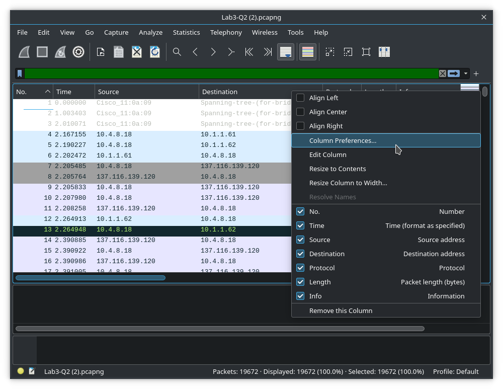

 - Under `Appearance` > `Columns`, click `+` to add new column

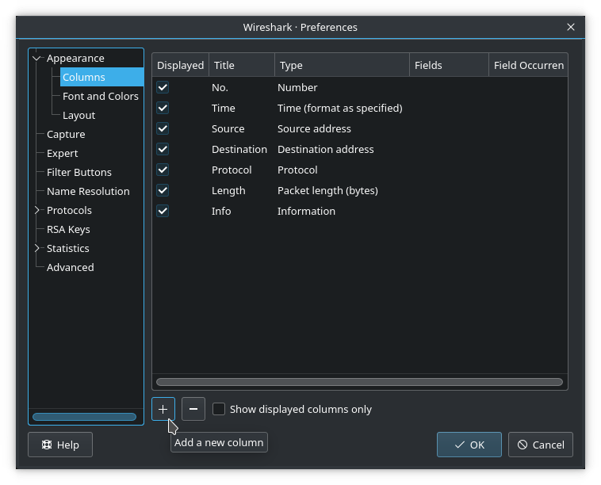

 - Set `Title` and `Type`

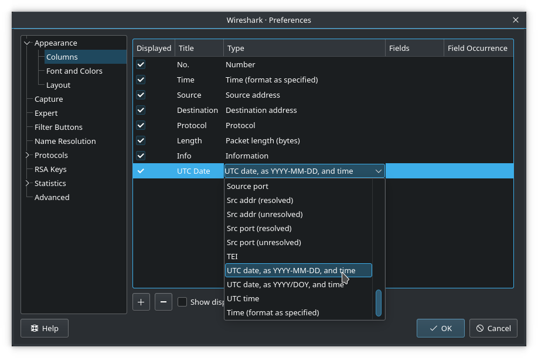

- Repeat for other columns. Columns with `Custom Type` will also require `Fields` to be set. Rows can be dragged to change column order.

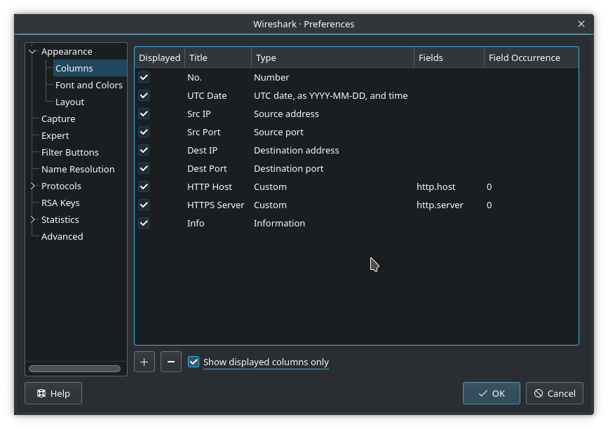

- Click `OK`

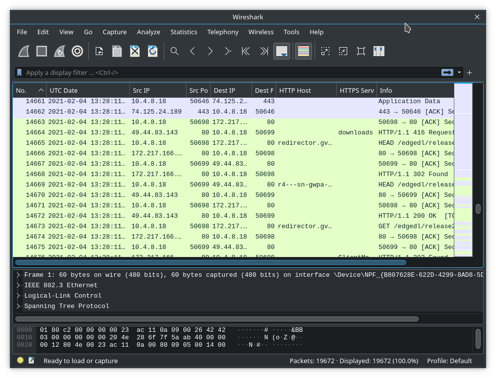

## 2.

### a. Identify the http request packet

- Use `http.request` display filter

  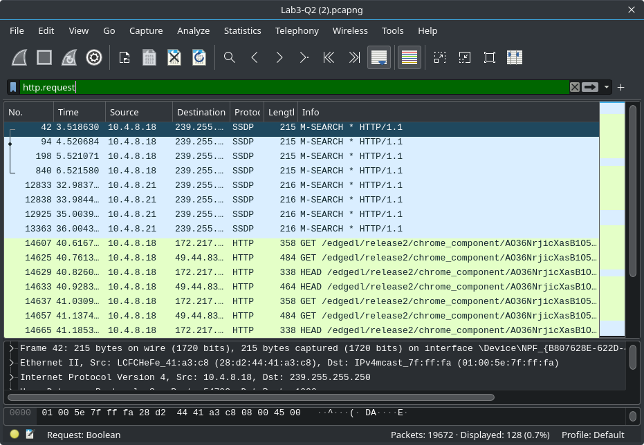

### b. Identify the http response packet

- Use `http.response` display filter

  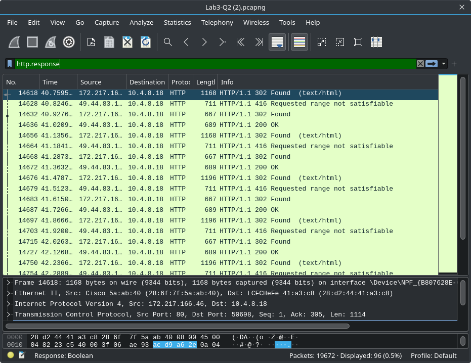

### c. Display the statistics of the TCP and UDP packets

- `Statistics` > `Packet Length`

- Apply `tcp || udp`, `tcp`, or `udp` display filters

  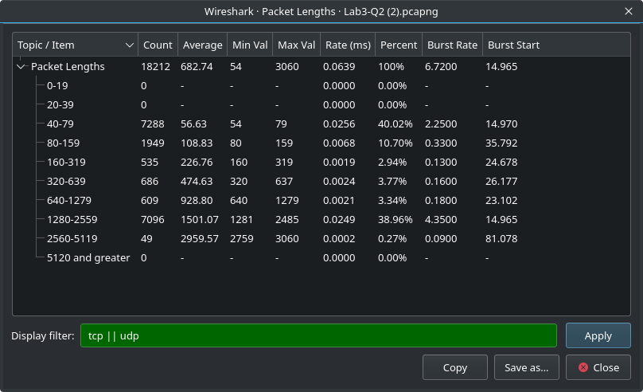
  
- Use `tcp || udp`, `tcp`, or `udp` display filters

- `Statistics` > `Protocol Hierarchy`

  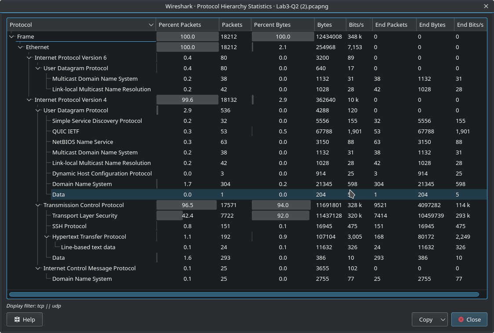

### d. List out the TCP packets whose syn and ack flags are on

- Use `tcp.flags.syn == 1 && tcp.flags.ack == 1` display filter

  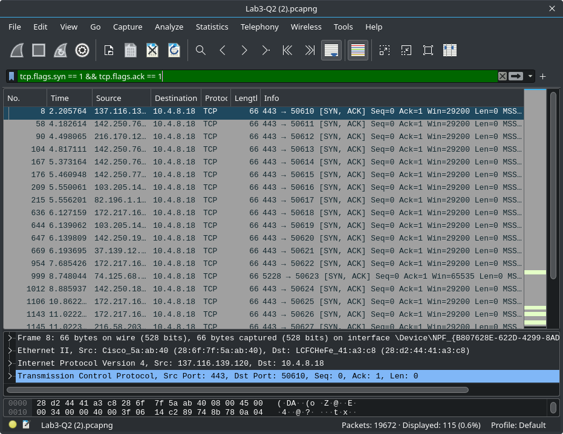

### e. List out the TCP and UDP packets where dest port=80

 - Use `tcp.dstport == 80 || udp.dstport == 80` display filter

   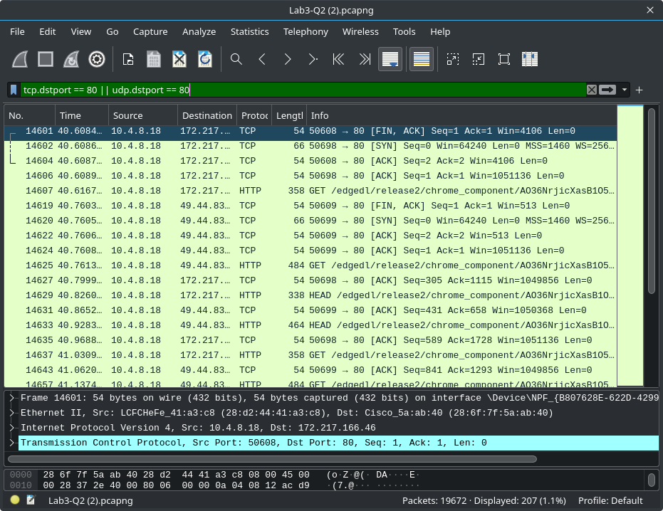

### f. List out the ARP packets

 - Use `arp` display filter

   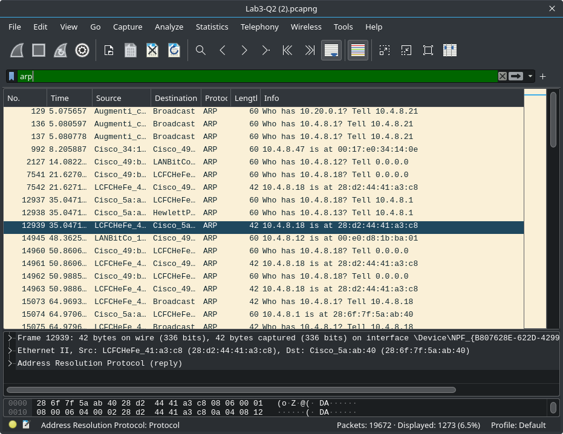

## 3.

Overview of the code
 - The server consists of 2 sections, `setup` and `serve`
 - The `setup` part creates a new socket, assigns it an IP and port, binds it, and starts listening on it.
 - The `serve` part is a loop which listens to incoming requests and sends them the message

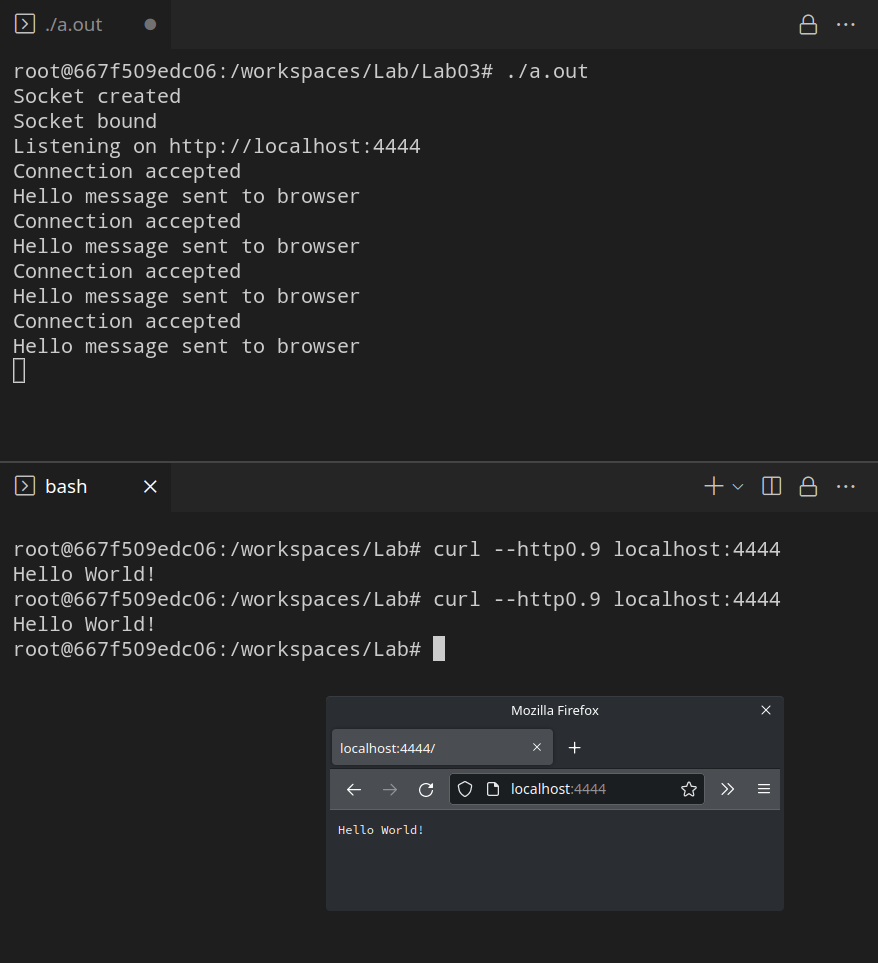

