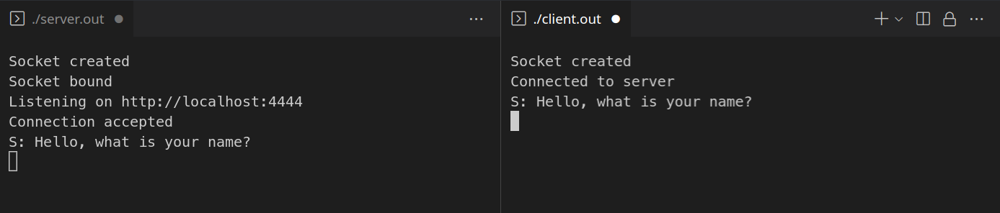
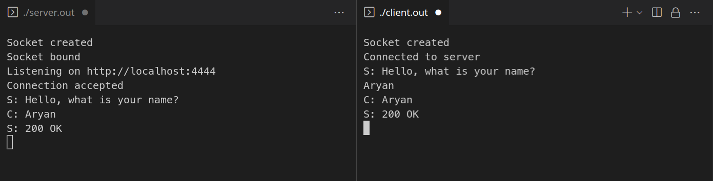
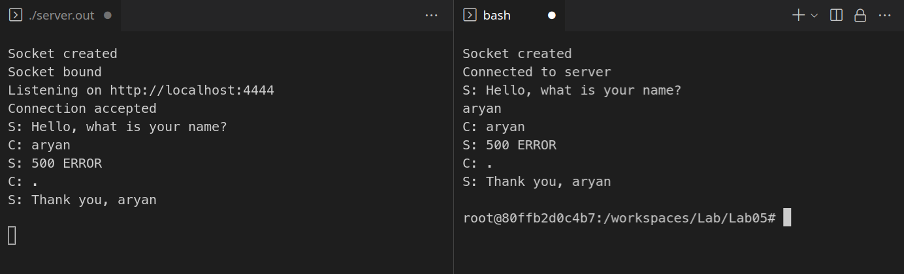
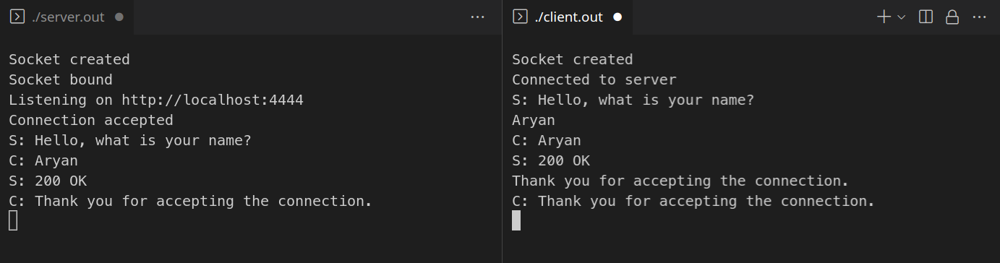
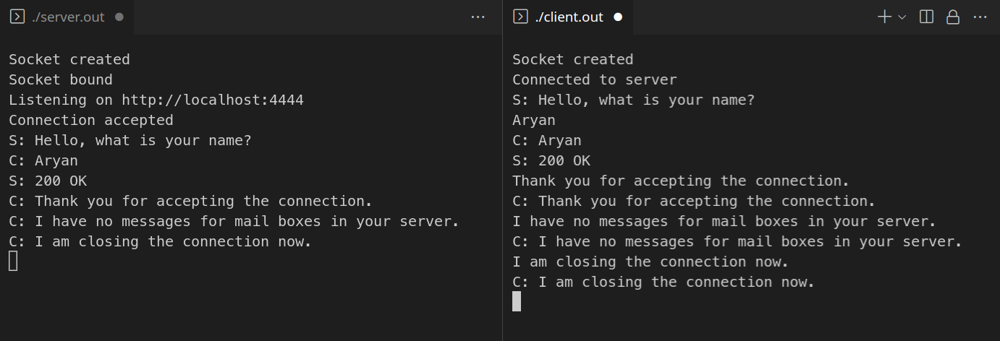
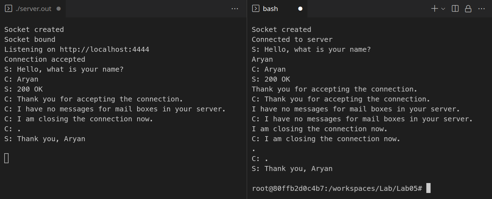

# Lab 5: Client-Server Communication

#### Aryan Tyagi

##### 2019A7PS0136G


## Compile and Run

 - Compilation

```bash
gcc server.c -o server.out
gcc client.c -o client.out
```

 - Start the server first

```bash
./server.out
```

 - Then start the client

```
./client.out
```

<div style="page-break-after: always;"></div>

## Screenshots

#### b. 



#### c.





<div style="page-break-after: always;"></div>

#### d.




#### e.



<div style="page-break-after: always;"></div>

#### f.



