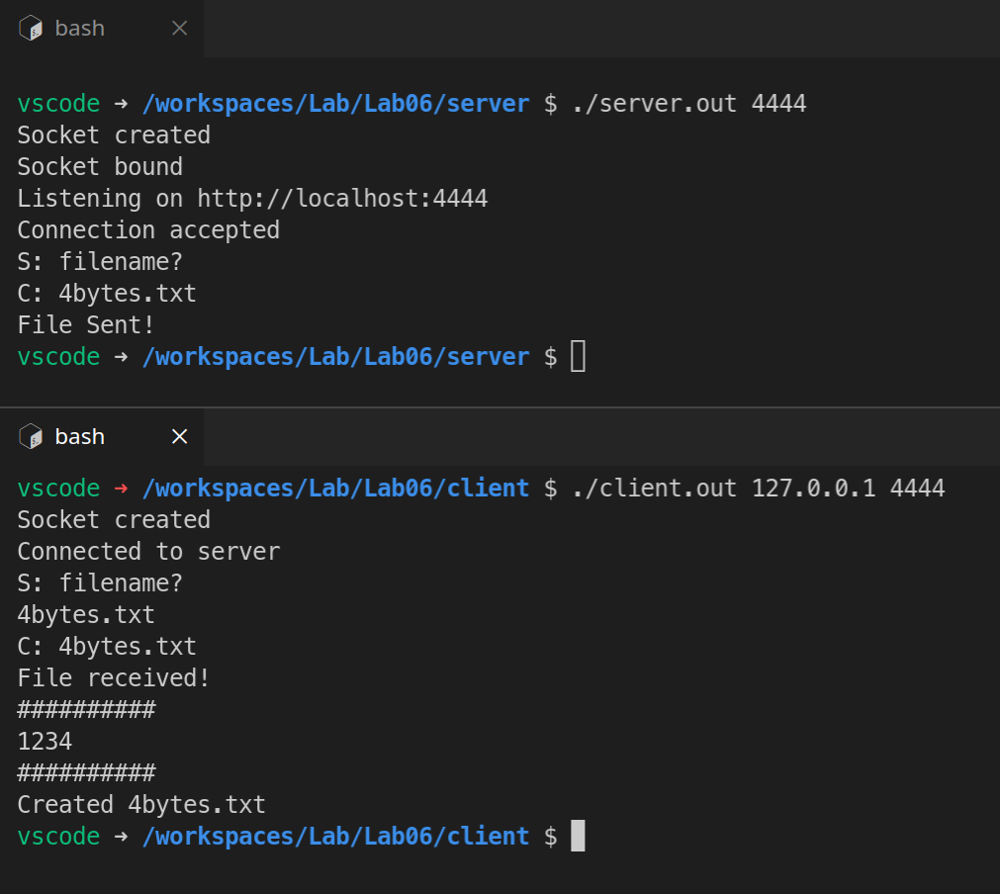

# Lab 6: More on Client Server Communication

#### Aryan Tyagi

##### 2019A7PS0136G


## Compile and Run


### Compilation

```bash
gcc ./server/server.c -o ./server/server.out
gcc ./client/client.c -o ./client/client.out
```

_OR_

```bash
make build
```


### Start the server first

```bash
cd server
./server.out 4444
```

_OR_

```bash
make server
```


### Then start the client

```bash
cd client
./client.out 127.0.0.1 4444
```

_OR_

```bash
make client
```


> NOTE: Running `./client/client.out` will write to incorrect directory


<div style="page-break-after: always;"></div>

## Screenshots

#### 1. Incomplete parameters


#### 2. Incorrect server address


<div style="page-break-after: always;"></div>

#### 3. More than 10 bytes


<div style="page-break-after: always;"></div>

#### 4. Less than 10 bytes



<div style="page-break-after: always;"></div>

#### 5. File does not exist


