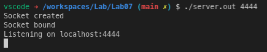
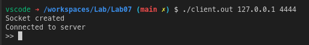
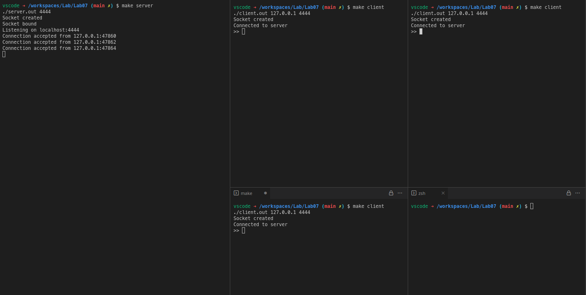
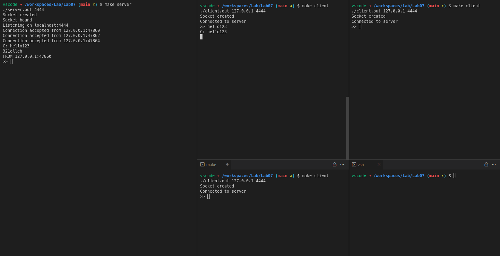
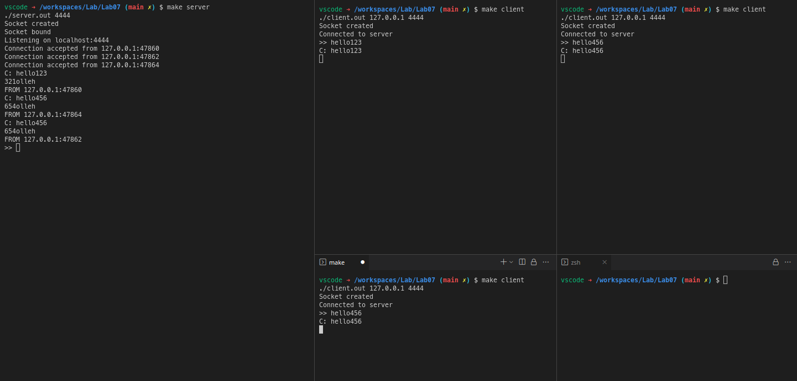
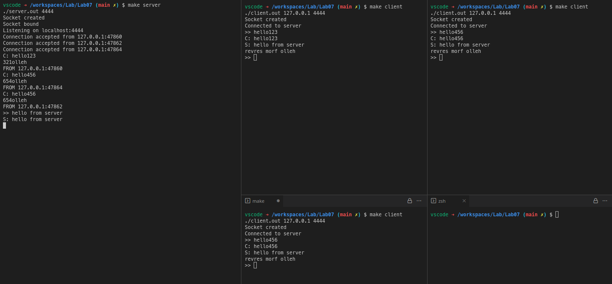
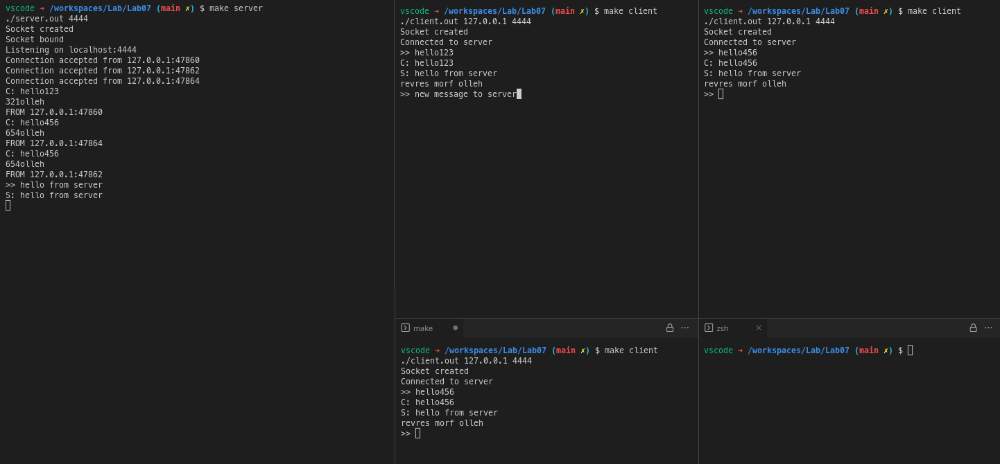
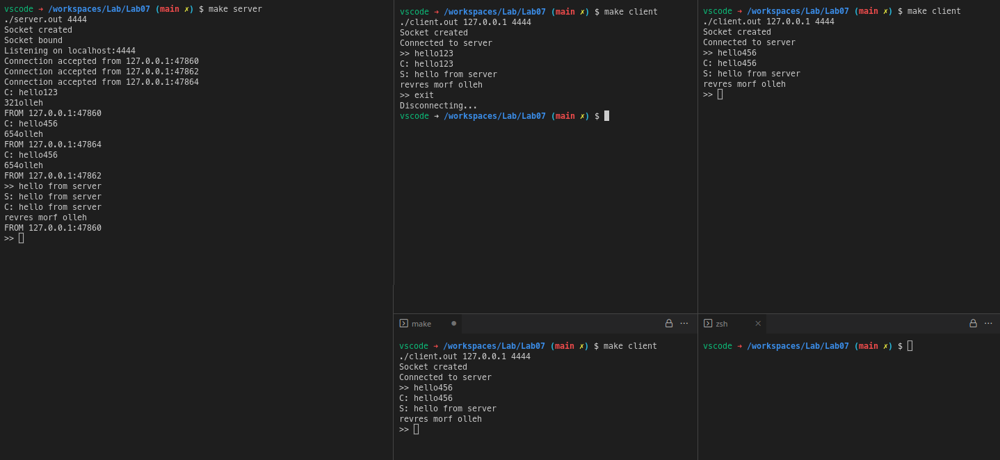
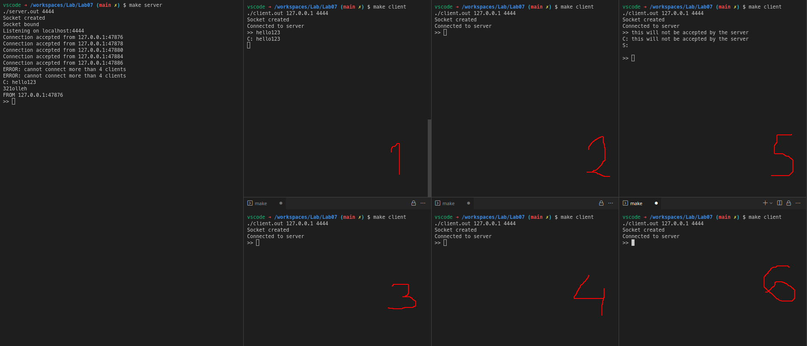

# Lab 7: TCP server accepting multiple client

#### Aryan Tyagi

##### 2019A7PS0136G


## Compile and Run


### Compilation

```bash
gcc ./server/server.c -o ./server/server.out
gcc ./client/client.c -o ./client/client.out
```

_OR_

```bash
make build
```


### Start the server first

```bash
./server.out 4444
```

_OR_

```bash
make server
```


### Then start the clients

```bash
./client.out 127.0.0.1 4444
```

_OR_

```bash
make client
```

<div style="page-break-after: always;"></div>


## Screenshots

### 1. The Server as a command line argument accepts the port number to which it should bind.



### 2. The client, as command line arguments, accepts the IP address and the port number at which it will find the server.



### 2. Start 3 separate instances of the client.



### 3. After connecting to the server, each client reads a line from the standard input and sends it to the server.



### 4. The server prints the received line in reverser order along with IP address and port number from which it received the message.



### 4. The server then reads a line from standard input and sends it to all the clients.



### 5. The client prints the received line in reverse order and are ready to accept a new line from the user.



### 6. The client exits if the user types “exit”.



### 7. The server at a time accepts utmost 4 clients.


