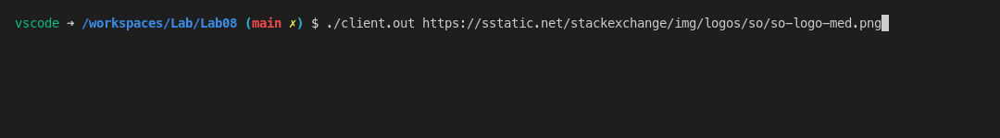
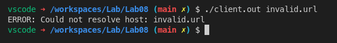
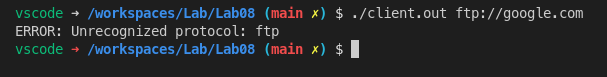
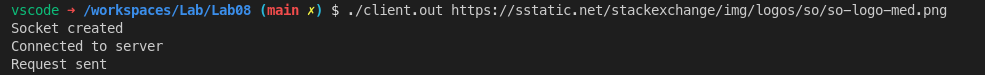
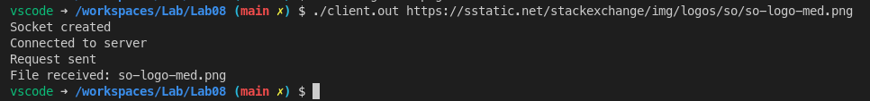
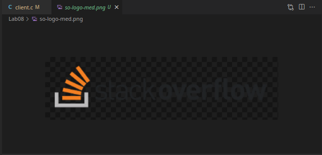
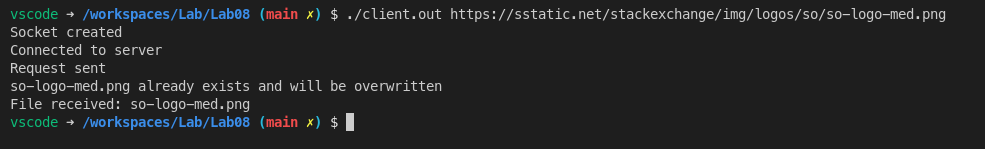
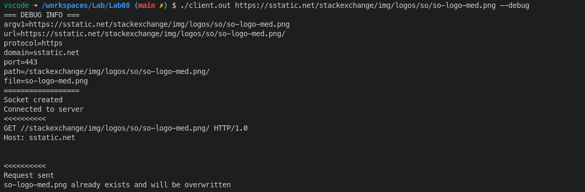

# Lab 8: TCP Client to Download File

#### Aryan Tyagi

##### 2019A7PS0136G


## Compile and Run

### Compilation

```bash
gcc ./client.c -o ./client.out
```

### Execution

```bash
./client.out https://sstatic.net/stackexchange/img/logos/so/so-logo-med.png
```

<div style="page-break-after: always;"></div>


## Screenshots

### 1. The client, as a command-line argument, accepts the URL of the file. The URL can be HTTP or HTTPS-based. (2 marks)



### 2. If the URL does not exist or unreachable, the client prints an error and exits. (2 marks)





### 3. After connecting to the server, the client sends a GET request to the server to get the file. (2 marks)



<div style="page-break-after: always;"></div>

### 4. The client downloads the whole file and saves it to the local folder with the same file name as mentioned in the URL. (6 marks)





### 5. If a file with the same name exists, the old file is overwritten. (1 mark)



### 6. The client exits after downloading the file. (1 mark)


<div style="page-break-after: always;"></div>

### Extra 

```bash
# run with --debug flag to get additional output
./client.out https://sstatic.net/stackexchange/img/logos/so/so-logo-med.png --debug
```

