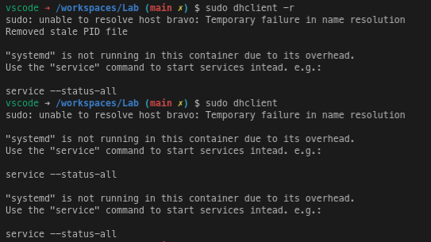

# Lab 9: Wireshark --- ARP, DHCP, and ICMP

#### Aryan Tyagi

##### 2019A7PS0136G

## 1. DHCP protocol

- Use `dhclinet` command to send DHCP requests

```bash
dhclient -r				# release the current lease
dhclient				# get new lease
```



### a. DHCP Request, Reply, and ACK messages

Packet Number `2554`, `2555`, `2556`, `2561` correspond to DHCP Discover, Offer, Request, ACK respectively.


<div style="page-break-after: always;"></div>

### b. IP addresses of the DHCP server and client

After DHCP ACK

- Client IP: `10.4.19.148`
- DHCP Server IP: `10.4.18.1`


<div style="page-break-after: always;"></div>

## 2. ARP protocol

- use `arping` to send ARP requests


### a. ARP Request and Reply messages

- Packet number `10117` is APR Request
- Packet number `10118` is APR Response


### b. MAC address of the the replier

MAC address of the the replier is `28:6f:7f:5a:ab:40`


<div style="page-break-after: always;"></div>

## 3. traceroute for dns.google

```bash
traceroute --icmp dns.google
# OR
traceroute --icmp 8.8.8.8
```


### a. IP address of your host and the destination

Host IP: `10.4.19.148`
Destination IP: `8.8.8.8`


<div style="page-break-after: always;"></div>

### b. raw bytes of the ICMP echo packet


- type `0x08`


- code `0x00`


<div style="page-break-after: always;"></div>

### c. raw bytes of the ICMP error packet


 - type `0x0b`


 - code `0x00`


<div style="page-break-after: always;"></div>

### d. last three ICMP packets received by the source host

- The last 3 ICMP packets are  ICMP Echo reply packets with type `0x00` and code `0x00`.


- ICMP reply packets have type `0x00`. ICMP request packets have type `0x08`. Other type values are used for errors; eg. TTL exceed error corresponds to type `0x0b`. This type indicates how the following bytes are to be interpreted.


