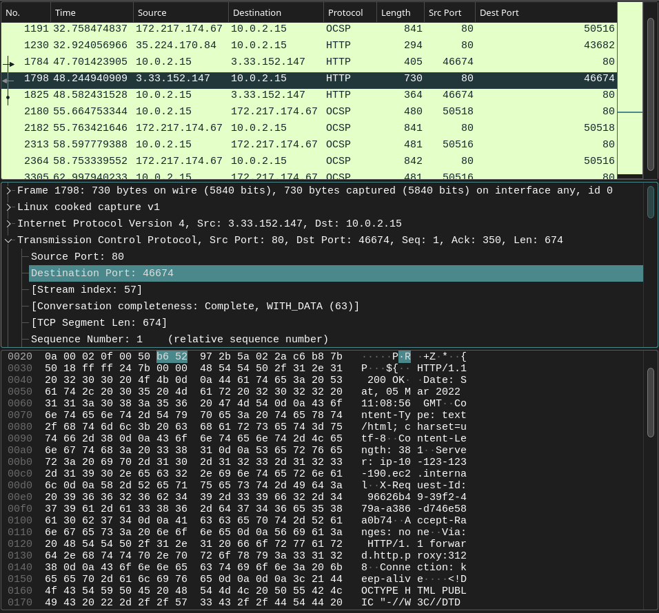

# Midsem Lab
## 2019A7PS0136G (31120190136)
### 7 March 2022

## Q1

### README

#### 11 Digit Campus ID: `31120190136`

#### Compilation

```bash
gcc server.c -o server.out
gcc client.c -o client.out
```

#### Running

```bash
./server.out 4444
```

```bash
./client.out 127.0.0.1 4444
```

##### Screenshots

###### 1. 


###### 2. 


###### 3. After connecting to the server, the client reads your campus id (3112xxxxxxx)


###### 4. The server prints the received campus id and then calculates the value of y


###### 5. extract the equation whose index is y obtained in step 4. **SEE CODE**

###### 6. The server solves the equation and sends the answer to the client.


###### 7. The server takes the student’s first name as input. If all alphabets are in lower case,   the server sends the name to the client.


###### 8. The client displays the <name>,<campus id>,<y> on its screen and exits.


###### 9. The server is ready to accept a new client


## Q2

### 1. 
IP address of local machine (the client) is `10.0.2.15`
The client sends `5` http requests (http.request filter used excluding OCSP)


### 2.

The client receives `4` http responses.


### 3.

`730 bytes`


### 4.

Right click column headers and choose `Column Preferences`


Under `Appearance > Column` click `+`

Give appropriate `Title` and `Type` to the columns as shown below and click `OK`


### 5.

RTT for the request sent to www.sougata-sen.com is `543.5 ms`


### 6.



Hex value of the destination port in the TCP header of the response is `b6 52`
